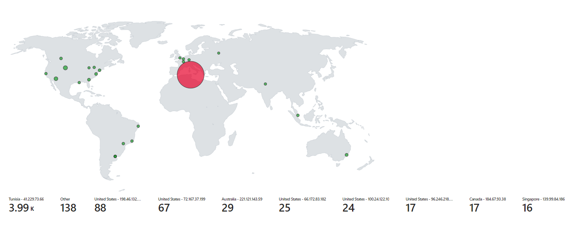

# Azure Sentinel Honeypot Attack Map

## Project Overview

In this cybersecurity initiative, I established a robust honeypot laboratory leveraging Microsoft's Azure platform. The primary objective was to create a controlled environment to attract and analyze potential attackers, subsequently consolidating the gathered data into Azure Sentinel, a powerful Security Information and Event Management (SIEM) solution.

### Key Project Steps

1. **Honeypot Deployment:**
   - Established a controlled virtual environment on Microsoft Azure, intentionally exposing a Virtual Machine (VM) as a honeypot. This environment facilitated the observation and logging of cybersecurity threats.

2. **PowerShell Script for Metadata Extraction:**
   - Utilized a custom PowerShell script to extract metadata from the Windows Event Viewer. The extracted data was then forwarded to a third-party API to derive geolocation information.

3. **Log Analytics Workspace Configuration:**
   - Configured a Log Analytics Workspace in Azure to ingest custom logs containing essential geographic information, including latitude, longitude, state/province, and country.

4. **Custom Fields in Log Analytics:**
   - Configured custom fields within the Log Analytics Workspace to streamline and enhance the mapping of geospatial data in Azure Sentinel.

5. **Azure Sentinel Workbook Configuration:**
   - Implemented a comprehensive Azure Sentinel workbook to visualize global attack data, specifically focusing on Remote Desktop Protocol (RDP) brute force attacks. The workbook provides insights into the physical location and magnitude of these attacks.

### Visualizing Global Attacks

The Azure Sentinel workbook dynamically displays RDP brute force attacks on a world map, offering a clear visualization of the geographical distribution and intensity of the attacks.

## Project Impact and Future Enhancements

### Impact

- **Advanced Threat Analysis:** The project enables advanced analysis of cybersecurity threats, providing valuable insights into attack patterns and global threat landscapes.

- **Educational Resource:** The project serves as an educational resource for cybersecurity enthusiasts and professionals, showcasing effective strategies for threat detection and visualization.

### Future Enhancements

- **Integration of Additional Data Sources:** Consider integrating additional threat intelligence sources to enhance the depth of analysis and broaden the scope of detected threats.

- **Refinement of Visualization:** Continuous refinement of the Azure Sentinel workbook to accommodate evolving attack scenarios and provide more nuanced visualizations.

---

**Note:** This project reflects my commitment to advancing cybersecurity capabilities and is an integral part of my professional portfolio. If you have any questions or feedback, feel free to [reach out](#contact).

